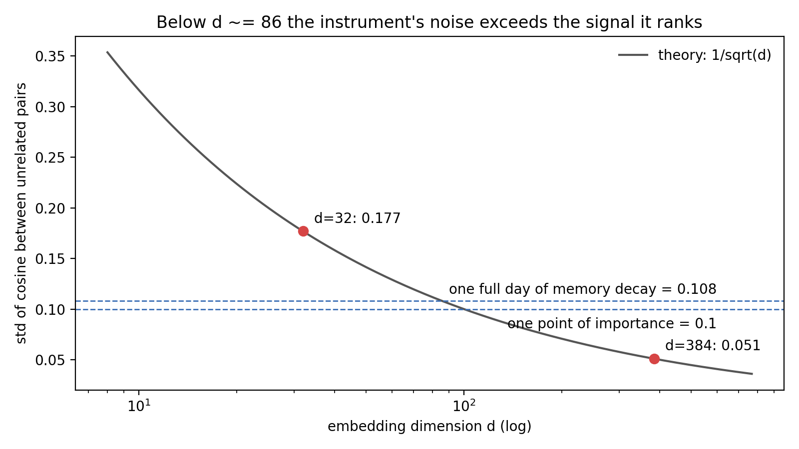

<div align="center">

# The Noisy TV in the Instrument

**Measurement-noise capture in the intrinsic-motivation instrumentation of LLM agents —
the noisy-TV problem, reborn inside the ruler.**

[](https://doi.org/10.5281/zenodo.21764607)
[](LICENSE)
[](LICENSES/CC-BY-4.0.txt)
[](https://www.python.org/)
[-brightgreen.svg)](tests)
[](output/hash-chain.md)

</div>

> [!IMPORTANT]
> **Finding.** Novelty and knowledge-gap metrics built on embedding cosines inherit a noise
> floor of ~`1/sqrt(d)`. At `d=32` that floor (`sigma = 0.177`) exceeds the very signals it
> ranks (`0.108`, `0.100`) — and a Goldilocks curiosity trigger fed by it pays **0.58 of
> maximum intensity for a gap made entirely of static**.

Execution-verified companion for the article
[*Noisy-TV em agentes LLM*](https://ulissesflores.com/artigos/noisy-tv-agentes)
(Ulisses Flores, 2026) and staging ground for the paper in progress.

> [!NOTE]
> **The paper grew out of this repository and now has its own.** *The Noisy TV in the
> Measurement Channel: Unbudgeted Instrument Noise in the Intrinsic-Motivation
> Instrumentation of LLM Agents* ships with a separate replication package —
> [`noisy-tv-measurement-channel`](https://github.com/ulissesflores/noisy-tv-measurement-channel)
> — carrying the clean-room harness, the pre-registration, the audit of eight deployed
> agent-memory systems and the calibration tool. This repository remains the artifact of the
> **measured instance**: the numbers it re-derives are the corroboration the paper cites, not
> the paper's anchor.

> **Nota em português:** repositório-companheiro do artigo. Todo número citado pelo texto é
> reproduzido por código determinístico, travado por teste e selado por cadeia SHA-256 —
> `python run_all.py` refaz a verificação inteira.

## What this contributes

1. **A measured instance** of the noisy-TV pathology in the *measurement channel* (not the
   reward channel) of a real autonomous agent — with the numbers, their provenance and
   their verification dates declared in [`data/measurements.json`](data/measurements.json).
2. **A minimal, sealed replication core**: the noise floor, the scaling law and the
   ghost-gap effect re-derived from scratch on every run and pinned by tests.
3. **The bridge bibliography** between two literatures that do not cite each other —
   classic noisy-TV (RL) and LLM-agent intrinsic-motivation instrumentation
   ([`BIBLIOGRAPHY.md`](BIBLIOGRAPHY.md)).

## At a glance

| Question | Answer |
|---|---|
| Headline numbers | `sigma = 0.177` (d=32) · `0.051` (d=384) · ghost gap `0.177` -> curiosity `0.58/1.0` |
| Reproducibility | deterministic (seed 0); one entry point (`run_all.py`); every number is a pytest assertion |
| Integrity | single `chain_hash` over code + data + results ([`output/hash-chain.md`](output/hash-chain.md)) |
| Real-system provenance | daimon calibration (private codebase; minimal rewrites + frozen measured data) |
| Pre-registration | falsifiable predictions + gate, draft: [`data/PREREGISTRATION.md`](data/PREREGISTRATION.md) |
| Status | v1.0.0 — first public release, archived on Zenodo · concept DOI [10.5281/zenodo.21764607](https://doi.org/10.5281/zenodo.21764607) |

## Quick start

```bash
pip install -r code/requirements.txt
python run_all.py
```

Expected output:

```text
[1/3] results.json written: {'d32': 0.177, 'd384': 0.051} / {'sigma_input': 0.177, 'gap': 0.177, 'intensity': 0.58}
[2/3] test suite green
[3/3] provenance chain built and verified
```

## Results (seed 0, 20,000 pairs per dimension)

| Quantity | Value | Where it comes from |
|---|---|---|
| Cosine noise floor, d=32 | **0.177** | `code/noise_floor.py` (demo) = daimon hash embedder (measured) |
| Cosine noise floor, d=384 | **0.051** | demo; daimon ONNX model measured 0.050 |
| Ranking signal: one day of memory decay | 0.108 | daimon calibration (frozen evidence) |
| Ranking signal: one point of importance | 0.100 | daimon calibration (frozen evidence) |
| Ghost gap at full coverage (d=32) | **0.177 -> intensity 0.58** | `code/gap_intensity.py` |
| Crossing: floor = signal | d ~= 86 | `1/sqrt(d) = 0.108` |

Figure regenerated from the declared data by
[`scripts/make_figures.py`](scripts/make_figures.py) (no figure without a claim):



## What is and isn't claimed

- **Claimed:** the `~1/sqrt(d)` floor for cosine similarity between unrelated items; that
  at `d=32` it exceeds the daimon's ranking signals; that a Goldilocks trigger fed by that
  floor fabricates curiosity at saturation (0.58/1.0). All of it re-derived here.
- **Not claimed:** that real text embeddings behave exactly like isotropic Gaussian vectors
  (they are anisotropic; the daimon match is by construction of its hash embedder); that
  any specific published agent framework is broken — the prior-art scan shows the
  *pattern* is used without noise treatment, which is the gap the paper addresses.
- **Frozen, not re-runnable:** the daimon in-situ measurements — see the two-seals
  contract in [`REPRODUCIBILITY.md`](REPRODUCIBILITY.md).

## Integrity

One `chain_hash` seals code, tests, declared data and derived results
(figures and lockfile are deliberately excluded so the seal survives machine changes):

```bash
python make_provenance.py --verify   # OK: chain_hash verified
```

CI ([`ci.yml`](.github/workflows/ci.yml)) verifies the committed chain and replays the
full replication on Python 3.11 and 3.12; lint (ruff + interrogate 100%) runs as a
separate job.

## Repository layout

```text
run_all.py            single-entry replication: results -> tests -> provenance
make_provenance.py    build/verify the SHA-256 chain (output/hash-chain.md)
code/                 noise_floor.py, gap_intensity.py, requirements.txt
data/                 measurements.json (declared numbers) · PREREGISTRATION.md (draft)
tests/                12 tests: published numbers, scaling law, determinism, code<->data
scripts/              make_figures.py (figures as code, claim-mapped)
output/               results.json, hash-chain.md, provenance.json, figures/
docs/                 pt-BR and en: methodology + reproducibility
REPRODUCIBILITY.md    two-seals contract and both replication tracks
BIBLIOGRAPHY.md       the two literatures + prior-art scan summary
ROADMAP.md            v0.2: colab, preregistered experiments, paper slot
```

## Author

**Carlos Ulisses Flores** — Codex Hash Research Laboratory

[](https://orcid.org/0000-0002-6034-7765)
[](https://ulissesflores.com)
[](http://lattes.cnpq.br/6905246706890561)

## Citation

Cite the **concept DOI** — it always resolves to the latest version
(version DOIs pin a specific release).
Machine-readable metadata: [`CITATION.cff`](CITATION.cff) · [`codemeta.json`](codemeta.json).

```bibtex
@software{flores_noisy_tv_instrumentation_2026,
  author    = {Flores, Carlos Ulisses},
  title     = {{The Noisy TV in the Instrument: measurement-noise capture
               in the intrinsic-motivation instrumentation of LLM agents}},
  year      = {2026},
  publisher = {Zenodo},
  doi       = {10.5281/zenodo.21764607},
  version   = {1.0.0},
  url       = {https://github.com/ulissesflores/noisy-tv-instrumentation},
  orcid     = {0000-0002-6034-7765}
}
```

## License

- **Code** (`code/`, `tests/`, `scripts/`, `run_all.py`, `make_provenance.py`):
  [Apache-2.0](LICENSE)
- **Content** (docs, declared data, figures, this README):
  [CC BY 4.0](LICENSES/CC-BY-4.0.txt)

Attribution details in [`NOTICE`](NOTICE).

## Anchor references

Burda et al. 2018 (arXiv:1808.04355, the noisy-TV experiment) · Mavor-Parker et al., ICML
2022 (arXiv:2102.04399) · Oudeyer & Kaplan 2007 (doi:10.3389/neuro.12.006.2007) ·
Schmidhuber 2008 (arXiv:0709.0674). Full map: [`BIBLIOGRAPHY.md`](BIBLIOGRAPHY.md).
